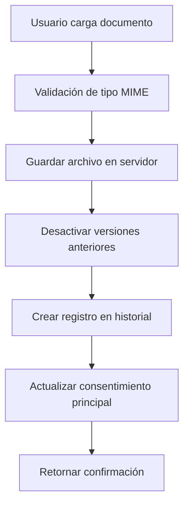

# LÓGICA DE IMPLEMENTACIÓN - SISTEMA DE HISTORIAL DE DOCUMENTOS

## 🎯 OBJETIVO PRINCIPAL
Crear un sistema robusto de versionado y trazabilidad para documentos de consentimiento veterinario que permita:
- Mantener historial completo de todos los documentos subidos
- Soportar múltiples tipos de archivo
- Proveer trazabilidad completa (quién, cuándo, qué)
- Gestionar versiones activas e inactivas

---

## 🏗️ ARQUITECTURA DE LA SOLUCIÓN

### 1. MODELO DE DATOS

#### Entidad Principal: Consent
- Mantiene la información básica del consentimiento
- Relación OneToMany con el historial de documentos
- Campos principales: tipo, descripción, estado, mascota, propietario

#### Entidad de Historial: ConsentDocumentHistory
```
consent_document_history
├── id (UUID) - Identificador único
├── consent_id (FK) - Relación con consentimiento
├── document_type - Tipo (consentimiento/cédula)
├── document_url - Ruta del archivo
├── original_file_name - Nombre original
├── mime_type - Tipo MIME
├── file_size - Tamaño en bytes
├── uploaded_by_id (FK) - Usuario que subió
├── uploaded_at - Fecha/hora de carga
├── is_active - Estado activo/inactivo
└── notes - Notas adicionales
```

### 2. FLUJO DE DATOS



### 3. GESTIÓN DE VERSIONES

#### Algoritmo de Versionado:
1. **Al subir nuevo documento:**
   ```typescript
   // Marcar documentos anteriores como inactivos
   await historyRepo.update(
     { consentId: id, isActive: true },
     { isActive: false }
   );
   ```

2. **Crear nuevo registro activo:**
   ```typescript
   const newHistory = historyRepo.create({
     consentId: id,
     documentType: type,
     documentUrl: url,
     isActive: true,
     // ... otros campos
   });
   ```

3. **Mantener referencia en consentimiento principal:**
   ```typescript
   consent.documentUrl = newDocumentUrl;
   consent.status = ConsentStatus.SIGNED;
   ```

### 4. VALIDACIÓN Y SEGURIDAD

#### Validación de Archivos:
- **Tipos permitidos:** PDF, JPEG, PNG, GIF, WEBP
- **Tamaño máximo:** 10MB
- **Nomenclatura:** consent-[timestamp]-[random].ext

#### Control de Acceso:
- Solo propietarios pueden subir documentos de sus mascotas
- Veterinarios pueden ver historial completo
- Administradores tienen acceso total

### 5. INTERFAZ DE USUARIO

#### Componente DocumentHistory:
```
DocumentHistory
├── Agrupación por fecha
├── Indicadores de estado (Actual/Anterior)
├── Metadatos completos
│   ├── Nombre archivo
│   ├── Tamaño
│   ├── Usuario
│   └── Timestamp
└── Acciones
    ├── Ver documento
    └── Descargar
```

#### Flujo Visual:
1. Usuario accede a "Ver historial de documentos"
2. Sistema carga todos los documentos del consentimiento
3. Agrupa por fecha para mejor visualización
4. Muestra estado actual vs. anteriores
5. Permite descarga y visualización

---

## 🔄 CASOS DE USO

### Caso 1: Primera Carga de Documento
1. Usuario sube consentimiento firmado
2. Sistema crea primer registro en historial
3. Marca como activo
4. Actualiza estado del consentimiento

### Caso 2: Actualización de Documento
1. Usuario sube nueva versión
2. Sistema marca versión anterior como inactiva
3. Crea nuevo registro activo
4. Mantiene ambas versiones para auditoría

### Caso 3: Consulta de Historial
1. Usuario solicita ver historial
2. Sistema recupera todos los documentos
3. Ordena por fecha descendente
4. Agrupa por día
5. Muestra con indicadores visuales

---

## 🛡️ CONSIDERACIONES DE SEGURIDAD

1. **Validación estricta de tipos MIME**
2. **Límite de tamaño de archivo**
3. **Nombres de archivo únicos y seguros**
4. **Control de acceso basado en roles**
5. **Auditoría completa de cambios**

---

## 📊 BENEFICIOS DE LA IMPLEMENTACIÓN

1. **Trazabilidad Completa:** Quién, cuándo y qué se subió
2. **Versionado Automático:** Sin pérdida de información histórica
3. **Flexibilidad:** Soporte para múltiples tipos de archivo
4. **Auditoría:** Cumplimiento con requisitos legales
5. **Experiencia de Usuario:** Interfaz intuitiva y clara

---

## 🔮 EXTENSIONES FUTURAS POSIBLES

1. **Firma digital avanzada** con certificados
2. **Comparación de versiones** lado a lado
3. **Notificaciones automáticas** de cambios
4. **Integración con almacenamiento en la nube** (S3, Azure Blob)
5. **OCR para extracción** de texto de imágenes
6. **Compresión automática** de archivos grandes